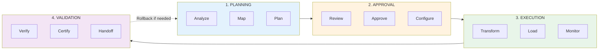

# Operations

## Running Migrations in Production

This section covers the operational aspects of running Sensei migrations — from planning through execution to post-migration validation and handoff.

---

### Migration Lifecycle

Every migration follows a predictable lifecycle:



→ [Migration Lifecycle](migration-lifecycle.md) — Detailed phase descriptions

---

### Operational Topics

| Topic | Description |
|-------|-------------|
| **[Planning Phase](planning-phase.md)** | Pre-migration preparation and analysis |
| **[Execution Phase](execution-phase.md)** | Running the migration |
| **[Validation Phase](validation-phase.md)** | Post-migration verification |
| **[Monitoring](monitoring.md)** | Real-time observability |
| **[Alerting](alerting.md)** | Notification configuration |
| **[Error Handling](error-handling.md)** | Error classification and recovery |
| **[Checkpointing](checkpointing.md)** | Resume capabilities |
| **[Rollback](rollback.md)** | Undo strategies |
| **[Performance Tuning](performance-tuning.md)** | Optimization techniques |
| **[Resource Management](resource-management.md)** | Compute, memory, storage |
| **[Scheduling](scheduling.md)** | Migration windows and automation |
| **[Parallel Migrations](parallel-migrations.md)** | Running multiple migrations |
| **[Incremental Migrations](incremental-migrations.md)** | Ongoing sync patterns |
| **[Cutover Strategies](cutover-strategies.md)** | Go-live approaches |
| **[Post-Migration](post-migration.md)** | Cleanup and handoff |
| **[Runbooks](runbooks.md)** | Standard operational procedures |

---

### Quick Reference

#### Migration States

| State | Description | Can Transition To |
|-------|-------------|-------------------|
| `created` | Migration configured but not started | `analyzing`, `cancelled` |
| `analyzing` | Schema analysis in progress | `planning`, `failed` |
| `planning` | Generating migration plan | `awaiting_approval`, `failed` |
| `awaiting_approval` | Plan ready for review | `approved`, `cancelled` |
| `approved` | Plan approved, ready to execute | `running`, `cancelled` |
| `running` | Migration in progress | `paused`, `completed`, `failed` |
| `paused` | Temporarily stopped | `running`, `cancelled` |
| `completed` | Migration finished successfully | `validating` |
| `validating` | Post-migration verification | `certified`, `failed` |
| `certified` | Verification passed | (terminal) |
| `failed` | Migration encountered unrecoverable error | `analyzing` (retry) |
| `cancelled` | User cancelled the migration | (terminal) |

#### Common Operations

```bash
# Start a migration
curl -X POST https://api.sensei.ai/v1/migrations/{id}/start

# Pause a running migration
curl -X POST https://api.sensei.ai/v1/migrations/{id}/pause

# Resume a paused migration
curl -X POST https://api.sensei.ai/v1/migrations/{id}/resume

# Cancel a migration
curl -X DELETE https://api.sensei.ai/v1/migrations/{id}

# Get current status
curl https://api.sensei.ai/v1/migrations/{id}/status
```

---

### Operational Principles

1. **Visibility first** — Monitor everything; surprises are operational failures
2. **Checkpoint aggressively** — Enable resume from any failure point
3. **Fail fast, recover faster** — Detect errors early, automate recovery
4. **Plan for rollback** — Every migration should be reversible
5. **Communicate proactively** — Stakeholders should never have to ask for status

---

### Getting Started

1. **Understand the lifecycle** → [Migration Lifecycle](migration-lifecycle.md)
2. **Configure monitoring** → [Monitoring](monitoring.md)
3. **Set up alerts** → [Alerting](alerting.md)
4. **Prepare runbooks** → [Runbooks](runbooks.md)
