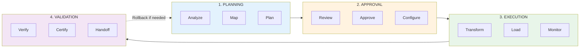

# Overview

## Running Migrations in Production

This section covers the operational aspects of running Sensei migrations — from planning through execution to post-migration validation and handoff.

***

### Migration Lifecycle

Every migration follows a predictable lifecycle:



→ [Migration Lifecycle](migration-lifecycle.md) — Detailed phase descriptions

***

### Operational Topics

| Topic                                                   | Description                            |
| ------------------------------------------------------- | -------------------------------------- |
| [**Planning Phase**](planning-phase.md)                 | Pre-migration preparation and analysis |
| [**Execution Phase**](execution-phase.md)               | Running the migration                  |
| [**Validation Phase**](validation-phase.md)             | Post-migration verification            |
| [**Monitoring**](monitoring.md)                         | Real-time observability                |
| [**Alerting**](alerting.md)                             | Notification configuration             |
| [**Error Handling**](error-handling.md)                 | Error classification and recovery      |
| [**Checkpointing**](checkpointing.md)                   | Resume capabilities                    |
| [**Rollback**](rollback.md)                             | Undo strategies                        |
| [**Performance Tuning**](performance-tuning.md)         | Optimization techniques                |
| [**Resource Management**](resource-management.md)       | Compute, memory, storage               |
| [**Scheduling**](scheduling.md)                         | Migration windows and automation       |
| [**Parallel Migrations**](parallel-migrations.md)       | Running multiple migrations            |
| [**Incremental Migrations**](incremental-migrations.md) | Ongoing sync patterns                  |
| [**Cutover Strategies**](cutover-strategies.md)         | Go-live approaches                     |
| [**Post-Migration**](post-migration.md)                 | Cleanup and handoff                    |
| [**Runbooks**](runbooks.md)                             | Standard operational procedures        |

***

### Quick Reference

#### Migration States

<table><thead><tr><th width="195.01953125">State</th><th>Description</th><th>Can Transition To</th></tr></thead><tbody><tr><td><code>created</code></td><td>Migration configured but not started</td><td><code>analyzing</code>, <code>cancelled</code></td></tr><tr><td><code>analyzing</code></td><td>Schema analysis in progress</td><td><code>planning</code>, <code>failed</code></td></tr><tr><td><code>planning</code></td><td>Generating migration plan</td><td><code>awaiting_approval</code>, <code>failed</code></td></tr><tr><td><code>awaiting_approval</code></td><td>Plan ready for review</td><td><code>approved</code>, <code>cancelled</code></td></tr><tr><td><code>approved</code></td><td>Plan approved, ready to execute</td><td><code>running</code>, <code>cancelled</code></td></tr><tr><td><code>running</code></td><td>Migration in progress</td><td><code>paused</code>, <code>completed</code>, <code>failed</code></td></tr><tr><td><code>paused</code></td><td>Temporarily stopped</td><td><code>running</code>, <code>cancelled</code></td></tr><tr><td><code>completed</code></td><td>Migration finished successfully</td><td><code>validating</code></td></tr><tr><td><code>validating</code></td><td>Post-migration verification</td><td><code>certified</code>, <code>failed</code></td></tr><tr><td><code>certified</code></td><td>Verification passed</td><td>(terminal)</td></tr><tr><td><code>failed</code></td><td>Migration encountered unrecoverable error</td><td><code>analyzing</code> (retry)</td></tr><tr><td><code>cancelled</code></td><td>User cancelled the migration</td><td>(terminal)</td></tr></tbody></table>

#### Common Operations

```bash
# Start a migration
curl -X POST https://api.sensei.ai/v1/migrations/{id}/start

# Pause a running migration
curl -X POST https://api.sensei.ai/v1/migrations/{id}/pause

# Resume a paused migration
curl -X POST https://api.sensei.ai/v1/migrations/{id}/resume

# Cancel a migration
curl -X DELETE https://api.sensei.ai/v1/migrations/{id}

# Get current status
curl https://api.sensei.ai/v1/migrations/{id}/status
```

***

### Operational Principles

1. **Visibility first** — Monitor everything; surprises are operational failures
2. **Checkpoint aggressively** — Enable resume from any failure point
3. **Fail fast, recover faster** — Detect errors early, automate recovery
4. **Plan for rollback** — Every migration should be reversible
5. **Communicate proactively** — Stakeholders should never have to ask for status

***

### Getting Started

1. **Understand the lifecycle** → [Migration Lifecycle](migration-lifecycle.md)
2. **Configure monitoring** → [Monitoring](monitoring.md)
3. **Set up alerts** → [Alerting](alerting.md)
4. **Prepare runbooks** → [Runbooks](runbooks.md)
